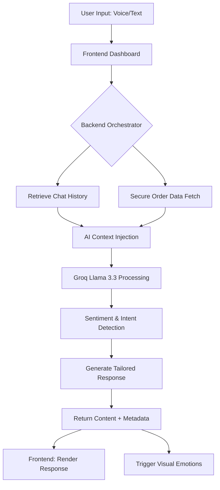

# AI Customer Support

[](https://nextjs.org/)
[](https://nodejs.org/)
[](https://www.mongodb.com/)
[](https://www.typescriptlang.org/)
[](https://groq.com/)

---

### Experience the Future of Customer Support
A sophisticated, high-fidelity AI orchestration system built for the modern ecommerce era. This platform goes beyond simple chat—it understands **emotion**, speaks **multiple languages**, and delivers **secure, factual data** in real-time.

---

## Key Capabilities

| Feature | Description |
| :--- | :--- |
| **Intelligent Orchestration** | Powered by Llama 3.3 for lightning-fast, context-aware reasoning. |
| **Sentiment Engine** | Detects tone (Anger, Frustration, Joy) and adapts the AI response accordingly. |
| **Visual Reactions** | Real-time emoji "fly-aways" triggered by emotional sentiment. |
| **Multilingual** | Seamlessly switches between English, Hindi, Gujarati, and more. |
| **Voice Interface** | WhatsApp-style voice-to-text for frictionless user interaction. |
| **Session Security** | Strict data isolation—users only access their specific order history. |

---

## System Architecture

### Frontend (Next.js 15+)
- **Premium UI**: Glassmorphism aesthetic with backdrop-blur effects.
- **Ambient Motion**: SaaS-style floating geometric background particles.
- **Real-time Feedback**: Dynamic UI states that react to AI metadata.

### Backend (Node.js & Express)
- **AI Core**: Groq SDK integration for high-performance LLM execution.
- **Data Truth**: Factual injection pipeline to eliminate AI hallucinations.
- **Persistence**: MongoDB Atlas for secure conversation and order storage.

---

## System Workflow



---

## Quick Start Guide

### 1. Clone & Install
```bash
git clone <your-repo-url>
cd ai-customer-support
```

### 2. Configure Backend
```bash
cd backend_Node
npm install
```
> [!IMPORTANT]
> Create a `.env` file in `backend_Node` with your `MONGODB_URI` and `GROQ_API_KEY`.

### 3. Launch the Platform
```bash
# In backend_Node
npm run dev

# In a new terminal
cd frontend
npm install
npm run dev
```
---

## Environment Reference

```env
PORT=8000
MONGODB_URI=mongodb+srv://...
GROQ_API_KEY=gsk_...
FRONTEND_URL=http://localhost:3000
```

---

## Security & Performance
- **Prompt Guard**: Multi-intent detection limits AI to ecommerce boundaries.
- **Truth Filtering**: Backend retrieves order data *before* the AI processes the response.
- **Optimization**: Minimal dependencies for ultra-fast page loads and transitions.

---

## Visual Gallery


---

